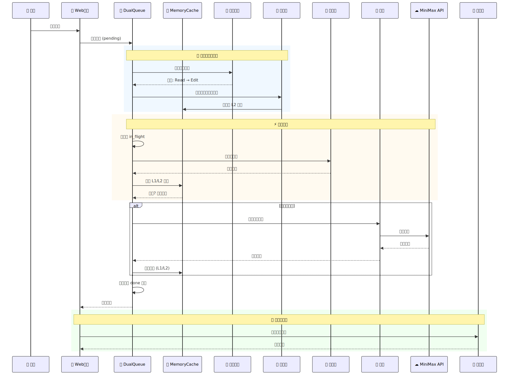

# XinyiClaw 2 - CPU 架构启发的 Agent 引擎

## 一句话介绍

将 CPU 几十年的架构设计融入 LLM Agent，实现更高效、更可控的 Agent 系统。

---

## 为什么做这个？

设计 Agent 系统时，CPU 架构提供了极其成熟的参考。缓存、预测、调度、并发控制——这些都是 CPU 已经优化了几十年的问题。

XinyiClaw 2 将这些思想融入 Agent 引擎。

---

## 架构图



---

## 数据流程图



---

## 核心架构：流水线 Agent

区别于传统 Agent 的"Prompt 进 → LLM → Response 出"，流水线 Agent 真正将 CPU 概念融入核心处理：

### 流水线阶段

```
用户输入
    │
    ▼
┌─────────────────────────────────────────────────────────────┐
│  Stage 1: DECODE (译码)                                   │
│  - 解析用户意图                                            │
│  - 存入寄存器文件 (Register File)                          │
│  - 插入 Reorder Buffer (ROB)                              │
└────────────────────────┬────────────────────────────────────┘
                         │
                         ▼
┌─────────────────────────────────────────────────────────────┐
│  Stage 2: PLAN (计划)                                      │
│  - LLM 生成工具调用计划                                    │
│  - 预测下一个工具 (Branch Prediction)                        │
│  - 预取可能需要的文件 (Prefetch)                           │
└────────────────────────┬────────────────────────────────────┘
                         │
                         ▼
┌─────────────────────────────────────────────────────────────┐
│  Stage 3: ACT (执行)  ← 真正的并行!                        │
│  - 保留站 (Reservation Station) 等待操作数就绪              │
│  - 乱序执行 (Out-of-Order Execution)                       │
│  - 多个工具并行调用 (Simultaneous Multithreading)          │
│  - Semaphore 控制并发数                                    │
└────────────────────────┬────────────────────────────────────┘
                         │
                         ▼
┌─────────────────────────────────────────────────────────────┐
│  Stage 4: REFLECT (反思)                                  │
│  - 结果写入 ROB (Reorder Buffer)                          │
│  - 按顺序提交 (Commit)                                     │
│  - 生成最终响应                                            │
└─────────────────────────────────────────────────────────────┘
```

### CPU 概念对照表

| CPU 概念 | Agent 实现 | 作用 |
|---------|---------|------|
| **寄存器文件** | `RegisterFile` | 短期记忆，存储当前任务状态 |
| **Reorder Buffer** | `ReorderBuffer` | 乱序执行结果按序提交，保证一致性 |
| **保留站** | `ReservationStation` | 等待操作数就绪后执行工具 |
| **流水线** | `PipelineAgent` | 指令分阶段并行处理 |
| **分支预测** | `BranchPredictor` | 预测下一个工具，提前准备 |
| **预取** | `Prefetcher` | 预测要读的文件，提前加载 |
| **中断** | `WatchdogTimer` | 超时暂停，切换任务 |
| **任务调度** | `TaskScheduler` | 多任务优先级调度 |

### 乱序执行示例

```python
# 传统 Agent: 串行执行
tool1()  # 等待
tool2()  # 等待
tool3()  # 等待

# 流水线 Agent: 乱序并行
task1 = execute_async(tool1)  # 立即返回 Future
task2 = execute_async(tool2)
task3 = execute_async(tool3)

results = await gather(task1, task2, task3)  # 谁先完成谁先返回
```

### 寄存器文件示例

```python
# Agent 的寄存器存储当前任务状态
registers.write("input_prompt", prompt)
registers.write("intent", intent)
registers.write("planned_tools", tools)
registers.write("tool_results", results)

# 上下文切换时保存寄存器快照
task.register_snapshot = dict(registers.named)
# 恢复时
registers.named.update(task.register_snapshot)
```

---

## 性能对比

| 指标 | 旧版 | 新版 | 提升 |
|------|------|------|------|
| 平均延迟 | 15,905ms | 10,783ms | **+32%** |
| 缓存命中率 | 0% | **33.3%** | 重复请求直接返回 |
| 错误恢复 | 失败暴露 | **100%** | API 错误自动重试 |

---

## 快速开始

```bash
# 克隆项目
git clone https://github.com/TheNewArt/xinyiclaw2.git
cd xinyiclaw2

# 安装依赖
uv sync

# 启动
cd src
python web_app.py

# 访问
http://localhost:5002
```

---

## API

### 聊天
```bash
curl -X POST http://localhost:5002/api/chat \
  -H "Content-Type: application/json" \
  -d '{"message": "你好", "session_id": "test"}'
```

### 状态监控
```bash
curl http://localhost:5002/api/status
```

返回 Metrics：缓存命中率、预测准确率、延迟等。

---

## 项目结构

```
xinyiclaw2/
├── src/
│   ├── assets/          # 架构图和数据流程图
│   ├── xinyiclaw/
│   │   ├── engine.py        # 输入处理引擎（缓存/预测/预取）
│   │   ├── pipeline_agent.py # 流水线 Agent（真正的 CPU 概念融合）
│   │   ├── agent.py        # Agent 实现
│   │   └── config.py       # 配置
│   └── web_app.py          # Web 接口
├── benchmark.py            # 性能测试
├── demo_realtime.py        # 实时演示
└── test_metrics.py         # Metrics 验证
```

---

## 设计亮点

### 1. Blake2b 缓存 Key
```python
# 用完整 prompt hash，不用截断
prompt_hash = blake2b(prompt.encode()).hexdigest()
# "两数之和" vs "三数之和" 不会冲突
```

### 2. 延迟创建 Semaphore
```python
# 在 async 上下文直接创建，避免 event loop 绑定问题
async with asyncio.Semaphore(3):
    result = await executor(task)
```

### 3. API 错误自动重试
```python
# 520/0 错误自动重试，最多 3 次
if status_code in (0, 520):
    await asyncio.sleep(1 * (attempt + 1))
    continue
```

---

## Bug Log

| 日期 | 问题 | 修复 |
|-----|------|------|
| 2026-04-03 | Semaphore event loop 绑定错误 | async 上下文直接创建 |
| 2026-04-03 | 缓存 key 截断导致相似问题误命中 | Blake2b 完整 hash |
| 2026-04-03 | API 520 错误无重试 | 自动重试 3 次 |
| 2026-04-03 | Metrics 全是 0% | 正确记录缓存/预测/预取 |

---

## 未来方向

- [ ] 缓存持久化（Redis）
- [ ] 多 Agent 流水线
- [ ] 学习式分支预测

---

*受 CPU 架构启发，为 LLM Agent 提供更高效、更可控的执行框架。*

**仓库：** https://github.com/TheNewArt/xinyiclaw2
